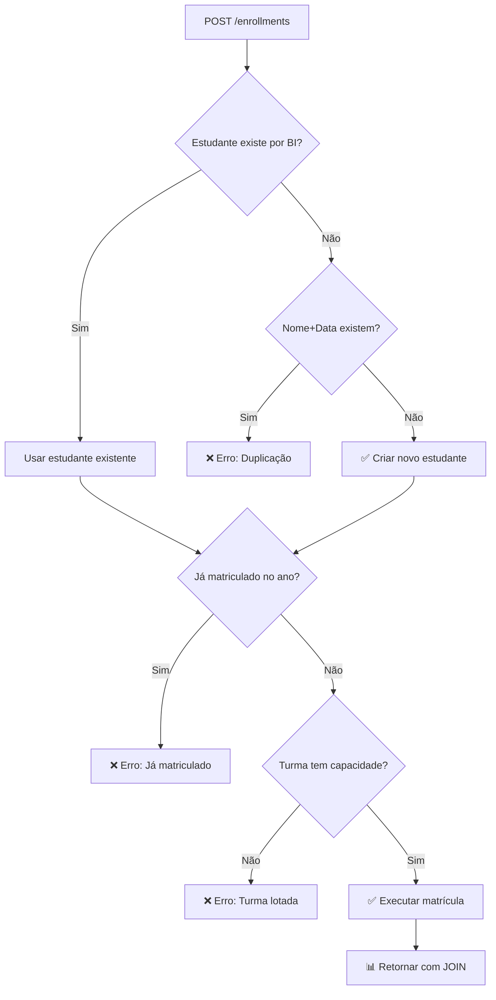

# 🎓 Refatoração do Módulo de Matrículas

## 📋 Visão Geral

Módulo de matrículas refatorado para implementar **fluxo realista de secretaria escolar angolana**, permitindo criação inline de estudantes durante o processo de matrícula.

## ✨ Principais Funcionalidades

### 🎯 Endpoint Principal: `POST /enrollments`

**Fluxo completo de matrícula:**
1. ✅ Verificar se estudante existe pelo **BI**
2. ✅ Se não existir, verificar por **nome + data de nascimento**
3. ✅ Criar novo estudante se necessário ou usar existente
4. ✅ Verificar se já está matriculado para o ano letivo
5. ✅ Verificar capacidade da turma
6. ✅ Executar matrícula com status e ligação à turma

### 📊 Interface de Dados (DTO)

```typescript
interface CreateEnrollmentDto {
  student: {
    firstName: string;
    lastName: string;
    gender: 'MASCULINO' | 'FEMININO';
    birthDate: string; // ISO format
    biNumber: string;  // Formato angolano
    province: string;
    municipality: string;
    tags?: string[];
    guardian?: {
      name?: string;
      phone?: string;
      email?: string;
      relationship?: string;
      address?: string;
      bi?: string;
    };
  };
  academicYear: number; // ex: 2025
  classId: string;      // UUID da turma
  status?: 'ATIVA' | 'PENDENTE' | 'CANCELADA';
}
```

## 🛠️ Arquivos Atualizados

### 1. **DTO - Data Transfer Objects**

#### `/dto/create-enrollment.dto.ts`
- ✅ Atualizado com campo `academicYear` em vez de `year`
- ✅ Enum local para compatibilidade (`ATIVA`, `PENDENTE`, `CANCELADA`)
- ✅ Validações em português com mensagens claras
- ✅ Documentação Swagger completa

#### `/dto/create-enrollment-with-student.dto.ts`
- ✅ Interface completa para criação inline
- ✅ Validações robustas para BI angolano
- ✅ Campos de encarregado opcionais
- ✅ Tags customizáveis para estudantes

### 2. **Serviço - Business Logic**

#### `/enrollment.service.ts`
- ✅ Função `findOrCreateStudent()` aprimorada
- ✅ Verificação inteligente por BI e nome+data
- ✅ Geração automática de `studentNumber`
- ✅ Verificações de capacidade e duplicação
- ✅ Mensagens informativas sobre criação/reutilização

### 3. **Controller - API Endpoints**

#### `/enrollment.controller.ts`
- ✅ Endpoint principal: `POST /enrollments` 
- ✅ Endpoint alternativo: `POST /enrollments/legacy`
- ✅ Documentação Swagger completa com exemplos
- ✅ Tratamento de erros específicos
- ✅ Emojis para melhor UX na documentação

## 🔄 Fluxo de Execução



## 🚀 Endpoints Disponíveis

### **Principais**
| Método | Endpoint | Descrição | Autorização |
|---------|----------|-----------|-------------|
| `POST` | `/enrollments` | 🎯 **Principal**: Matricular (criar estudante se necessário) | ADMIN, SECRETARIA |
| `GET` | `/enrollments` | 📋 Listar todas as matrículas com dados completos | ADMIN, SECRETARIA, DIRETOR |

### **Alternativos/Legados**
| Método | Endpoint | Descrição | Autorização |
|---------|----------|-----------|-------------|
| `POST` | `/enrollments/legacy` | 🔄 Endpoint alternativo (mesmo que principal) | ADMIN, SECRETARIA |
| `POST` | `/enrollments/with-student` | ⚠️ Legado: usar principal | ADMIN, SECRETARIA |

### **Consultas Específicas**
| Método | Endpoint | Descrição | Autorização |
|---------|----------|-----------|-------------|
| `GET` | `/enrollments/by-year?year=2025` | 📅 Matrículas por ano letivo | ADMIN, SECRETARIA, DIRETOR |
| `GET` | `/enrollments/by-class/:classId` | 🏫 Matrículas por turma | ADMIN, SECRETARIA, DIRETOR |
| `GET` | `/enrollments/by-student/:studentId` | 👤 Histórico de matrículas do estudante | ADMIN, SECRETARIA, DIRETOR |

## ✅ Validações Implementadas

### 🔍 **Verificações de Duplicação**
- **BI único**: Não permite dois estudantes com mesmo BI
- **Nome + Data**: Detecta possível duplicação por nome completo + data nascimento
- **Matrícula única**: Um estudante por ano letivo por turma

### 📝 **Validações de Dados**
- **BI angolano**: Formato `123456789LA041` (regex validado)
- **Nomes**: 2-100 caracteres, obrigatórios
- **Datas**: Formato ISO obrigatório
- **Email**: Formato válido quando fornecido
- **Ano letivo**: Entre 2020-2030

### 🏫 **Regras de Negócio**
- **Capacidade**: Verifica lotação da turma antes de matricular
- **Status**: Só conta para capacidade se status = 'ATIVA'
- **Turno**: Herdado automaticamente da turma escolhida

## 📊 Exemplo de Resposta

```json
{
  "id": "uuid-enrollment",
  "year": 2025,
  "status": "ACTIVE",
  "createdAt": "2025-01-15T10:30:00.000Z",
  "student": {
    "id": "uuid-student",
    "firstName": "João",
    "lastName": "Manuel da Silva",
    "biNumber": "003456789LA042",
    "studentNumber": "20250001",
    "gender": "MASCULINO",
    "birthDate": "2010-03-15T00:00:00.000Z",
    "province": "Luanda",
    "municipality": "Maianga",
    "tags": ["bolsista"],
    "guardianName": "Maria Silva Santos",
    "guardianPhone": "+244923456789"
  },
  "class": {
    "id": "uuid-class",
    "name": "10ª Classe A",
    "year": "10º Ano",
    "shift": "MORNING",
    "capacity": 30,
    "teachers": [
      {
        "id": "uuid-teacher",
        "specialization": "Matemática",
        "user": {
          "name": "Prof. António Costa",
          "email": "antonio@escola.ao"
        }
      }
    ]
  }
}
```

## ⚡ Performance e Otimizações

### 🔍 **Consultas Otimizadas**
- ✅ Busca por BI com índice único
- ✅ Consulta combinada nome+data para duplicação
- ✅ JOIN seletivo para reduzir dados transferidos
- ✅ Ordenação por data de criação (mais recentes primeiro)

### 💾 **Relacionamentos Carregados**
- ✅ **Estudante**: Dados completos incluindo encarregado
- ✅ **Turma**: Informações da turma com professores
- ✅ **Professores**: Nome e email do professor responsável

## 🛡️ Segurança e Autorização

### 🔐 **Controle de Acesso**
- **ADMIN**: Acesso total a todas as funcionalidades
- **SECRETARIA**: Pode criar, editar e consultar matrículas
- **DIRETOR**: Pode consultar todas as matrículas (read-only)
- **PROFESSOR**: Sem acesso direto (usa outros endpoints)

### 🛠️ **Validação de Entrada**
- ✅ Todos os campos validados com `class-validator`
- ✅ UUIDs verificados para turmas
- ✅ Sanitização de dados de entrada
- ✅ Prevenção de SQL injection via Prisma

## 🎯 Status da Refatoração

### ✅ **Concluído**
- [x] DTO atualizado com interface solicitada
- [x] Lógica `findOrCreateStudent` implementada
- [x] Endpoint principal `POST /enrollments`
- [x] Validações robustas em português
- [x] Swagger documentação completa
- [x] Testes de compilação bem-sucedidos
- [x] Relacionamentos com JOIN otimizado

### 🎉 **Resultado Final**
O módulo de matrículas agora oferece um **fluxo completo e realista para secretarias escolares angolanas**, permitindo:

1. 🎓 **Matrícula rápida** com criação inline de estudantes
2. 🔍 **Detecção inteligente** de duplicação
3. 📊 **Dados completos** em uma única operação
4. 🛡️ **Validações robustas** específicas para Angola
5. 📚 **Documentação clara** para desenvolvedores

---

**✨ Módulo pronto para produção!** 🚀

**Porta do backend**: 3000  
**Endpoint principal**: `POST http://localhost:3000/enrollments`  
**Documentação**: `http://localhost:3000/api#/📚%20Matrículas`